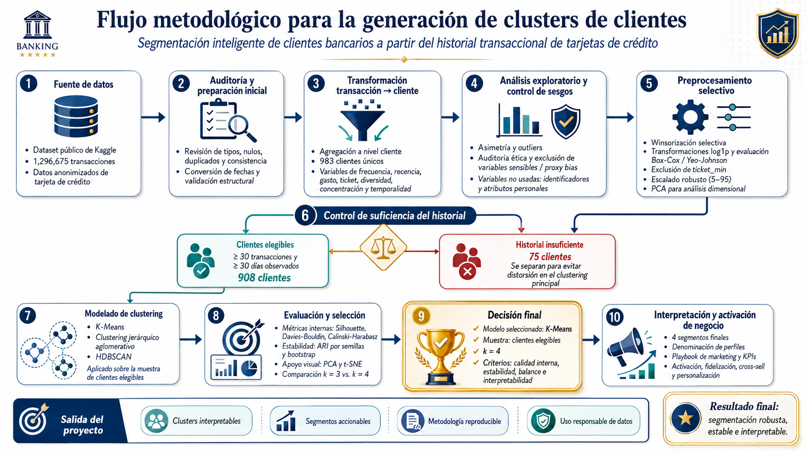
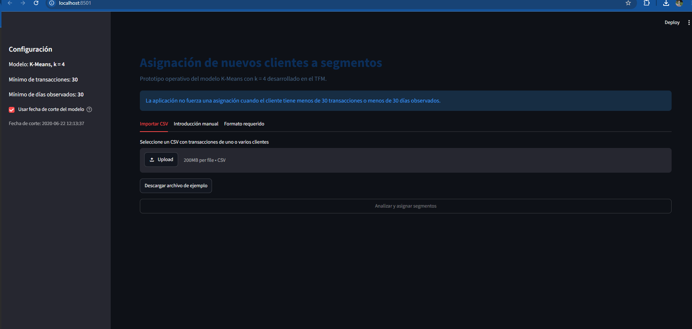

# Segmentación inteligente de clientes bancarios

Repositorio reproducible del Trabajo Fin de Máster **“Segmentación inteligente de clientes bancarios a partir del historial transaccional de tarjetas de crédito mediante técnicas de aprendizaje automático para apoyar estrategias de marketing y fidelización”**.

## Objetivo

Construir una segmentación de clientes basada en comportamiento transaccional, evaluar su calidad y estabilidad, traducir los segmentos a acciones de marketing y operacionalizar el modelo mediante una interfaz que permita asignar nuevos clientes elegibles.

## Resultado principal

- Dataset público y anonimizado de Kaggle.
- 1,296,675 transacciones y 983 clientes únicos.
- 908 clientes elegibles: mínimo 30 transacciones y 30 días observados.
- Modelo final: K-Means con `k = 4`.
- Cuatro perfiles interpretables y accionables.
- Prototipo Streamlit para carga de CSV, validación de elegibilidad y asignación de segmento.
- Validación fuera de muestra repetida 20 veces.

## Flujo metodológico



## Estructura del repositorio

```text
.
├── README.md
├── requirements.txt
├── app.py
├── segmentation_core.py
├── notebooks/
│   └── TFM_Segmentacion_Clientes_End_to_End.ipynb
├── artifacts/
│   ├── README.md
│   └── segmentation_bundle.joblib
├── data/
│   ├── cliente_ejemplo.csv
│   ├── plantilla_transacciones.csv
│   └── prueba_lote_clientes_mixto.csv
├── validation/
│   ├── README.md
│   ├── validacion_holdout_resumen.csv
│   └── validacion_holdout_repeticiones.csv
├── docs/
│   ├── flujo_metodologico_clustering.png
│   └── interfaz_general.png
└── tests/
    └── test_core.py
```

## Fuente de datos

El notebook descarga de forma reproducible el dataset público utilizado en el TFM. El dataset completo no se incluye en este repositorio para evitar duplicación, mantener el repositorio ligero y respetar la distribución desde su fuente original.

## Requisitos

Se recomienda Python 3.11.

```bash
python -m venv .venv
```

En Windows:

```bat
.\.venv\Scripts\python.exe -m pip install --upgrade pip
.\.venv\Scripts\python.exe -m pip install -r requirements.txt
```

## Ejecución del prototipo

Compruebe que exista:

```text
artifacts/segmentation_bundle.joblib
```

Después ejecute:

```bat
.\.venv\Scripts\python.exe -m streamlit run app.py
```

La aplicación se abrirá normalmente en `http://localhost:8501`.

## Formato mínimo del CSV

```text
cc_num,trans_date_trans_time,amt,category,merchant
```

Ejemplo:

```csv
CLIENTE_001,2020-01-01 10:30:00,42.50,grocery_pos,Comercio_A
CLIENTE_001,2020-01-05 18:45:00,85.20,shopping_pos,Comercio_B
```

## Regla de elegibilidad

La aplicación asigna un cluster únicamente cuando el cliente dispone de:

- al menos 30 transacciones;
- al menos 30 días observados.

Los clientes que no cumplen ambos criterios se clasifican como `Historial insuficiente` y no reciben una asignación forzada.

## Validación

La solución fue comprobada mediante:

1. cliente elegible conocido;
2. cliente con historial insuficiente;
3. procesamiento por lote con decisiones distintas;
4. recuperación de un cliente real de cada segmento;
5. validación fuera de muestra con 20 particiones estratificadas.

Resultados agregados del holdout:

- ARI medio: 0.9747;
- NMI media: 0.9681;
- concordancia alineada media: 98.93 %;
- clientes dentro del umbral P95 del centroide: 94.12 %;
- recuperación de los cuatro segmentos: 20 de 20 repeticiones.

Estas cifras evalúan consistencia estructural respecto de la partición final de referencia; no constituyen exactitud supervisada con etiquetas verdaderas.

## Interfaz



## Uso responsable y limitaciones

- No se utilizan variables personales o sensibles en el clustering principal.
- La aplicación es un prototipo académico local, no una solución bancaria productiva.
- Un cliente sin historial suficiente no puede segmentarse de forma robusta con este enfoque comportamental.
- La aplicación requiere reentrenamiento y monitorización antes de aplicarse a datos contemporáneos de una entidad financiera real.
- Los archivos `joblib` solo deben cargarse desde fuentes confiables.

## Autor

Joel Bonilla — Máster Universitario en Inteligencia Artificial, Universidad Alfonso X el Sabio.
